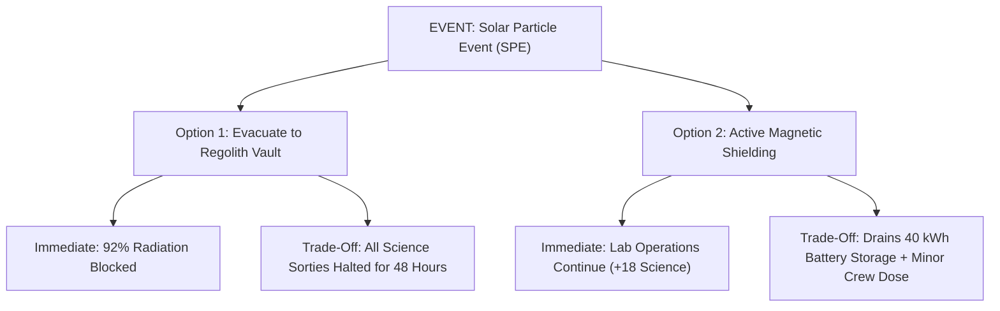

# Game Design Document (GDD)
# OUTPOST: Junior Astronaut Mission Trainer

---

## 1. Core Philosophy & Design Pillars

### Pillar 1: Every Engineering Decision Has Consequences
There are no "free lunches" in aerospace engineering. Upgrading radiation shielding makes the crew safer from solar flares, but uses launch payload mass that could have carried extra food or replacement water pumps.

### Pillar 2: Systems Are Interconnected, Not Isolated
Resources are not decorative progress bars. Power feeds the water distiller; recycled water feeds the oxygen electrolysis reactor; plants consume carbon dioxide and produce oxygen; a dust storm that cuts power will cascade into water shortages and crop starvation three days later.

### Pillar 3: Junior Accessible, Commander Deep
A 10-year-old student can grasp the game in two minutes through intuitive visual cards and plain-language alerts (`Junior Mode`), while high schoolers or space enthusiasts can toggle `Mission Commander Mode` to analyze exact kilowatt loads, optical depth formulas, and dosimetry curves.

---

## 2. Core Game Modes

| Mode | Target Audience | Telemetry Displayed | Feedback Mechanism |
| :--- | :--- | :--- | :--- |
| **Junior Mission** | Elementary & Middle School | Percentage buffers, status icons (`SAFE`, `WARN`, `CRITICAL`), trend arrows | Plain-language cause-and-effect cards ("Your solar panels have dust, so the greenhouse has less power") |
| **Mission Commander** | High School, Educators, Judges | Exact metrics (kW, L/day, kg O₂, mSv/day, optical depth $\tau$, efficiency $\eta$) | Deep electrical bus breakdown, ECLSS loop closure %, single-point dependency matrix |

---

## 3. The Six Core Resources & Mathematical Dynamics

### 1. Oxygen ($O_2$)
- **Baseline Reserves**: $140\text{ kg}$ stored in cryogenic tanks (capacity $180\text{ kg}$).
- **Crew Consumption**: $0.84\text{ kg/day}$ per active astronaut (NASA standard metabolic rate).
- **Production**: Water electrolysis + Sabatier reclamation + Hydroponic photosynthesis.
- **Critical Threshold**: Below $20\text{ kg}$, hypoxia alarms sound; at $0\text{ kg}$, mission fails immediately.

### 2. Water ($H_2O$)
- **Baseline Reserves**: $160\text{ L}$ potable water (capacity $200\text{ L}$).
- **Crew Consumption**: $2.5\text{ L/day}$ per astronaut (drinking, food hydration).
- **Greenhouse Irrigation**: $2.5\text{ L/day}$ per greenhouse level.
- **Recovery Loop**: Exploration Water Recovery System recovers $90\%\text{--}98\%$ of wastewater.
- **Consequences**: Depletion shuts down crop growth and rapidly degrades crew physical stamina.

### 3. Electrical Power
- **Generation**: Photovoltaic triple-junction solar panels.
  - Moon: High peak flux ($1,361\text{ W/m}^2$) during sunlight, $0\text{ W/m}^2$ in shadow.
  - Mars: Lower base flux ($590\text{ W/m}^2$), attenuated by atmospheric dust ($\text{dustFactor} = 1 - 0.85 \times \tau$).
- **Storage**: Chemical lithium-ion/fuel-cell battery banks ($100\text{ kWh}$ capacity).
- **Load Shedding**: When battery reserves drop below $5\text{ kWh}$, non-critical loads (Science Lab, Rover Garage) automatically trip breakers to safeguard Life Support.

### 4. Food & Nutrition
- **Pantry Rations**: Pre-packaged freeze-dried rations ($130\text{ kg}$ starting).
- **Daily Consumption**: $1.4\text{ kg/day}$ per astronaut.
- **Bioregenerative Crops**: Hydroponic microgreens and dwarf wheat provide fresh calories and vital vitamins ($C$ and $K$). If power or water fails, greenhouse harvest drops.

### 5. Radiation Shielding
- **Index Range**: 0 to 100 Effective Attenuation.
- **Shielding Composition**: Sintered lunar/Martian regolith berms and habitat water jackets.
- **Absorbed Dose**:
  $$\text{Daily Dose (mSv)} = \text{Base Flux} \times \left(1 - \frac{\text{Shielding}}{100} \times \text{ModuleFactor}\right)$$
- **Solar Particle Events (SPE)**: Flare events spike radiation by $4.5\times$, requiring crew evacuation to the reinforced storm shelter.

### 6. Spare Parts & Resilience
- **Inventory**: Starting with 45 replacement components.
- **Purpose**: Consumed to repair pump failures, unclog Sabatier reactors, and replace worn solar panel bearings.
- **In-Situ Additive Manufacturing**: The 3D Spare Fabricator bay slowly prints replacement parts ($+0.8\text{ units/day}$) when power is abundant.

---

## 4. Flight Crew Roster & Specialties

1. **Commander Maya Lin (Polaris-1)**:
   - *Specialty*: Expedition Command & Crisis Demeanor.
   - *Bonus*: $+15\%$ Morale resilience; reduces astronaut stress accumulation during emergencies.
2. **Engineer Tariq Al-Mansoor (Vector-2)**:
   - *Specialty*: ECLSS & Power Subsystems.
   - *Bonus*: $+25\%$ repair speed; consumes $-30\%$ fewer spare parts per equipment overhaul.
3. **Biologist Elena Rostova (Sprout-3)**:
   - *Specialty*: Hydroponics & Bioregenerative Loop Closure.
   - *Bonus*: $+20\%$ crop yield per liter of water; $+15\%$ water recovery efficiency.
4. **Scientist Marcus Chen (Nova-4)**:
   - *Specialty*: Astrobiology & Planetary Geology.
   - *Bonus*: $+35\%$ scientific telemetry throughput from laboratory experiments and rover sorties.

---

## 5. Event Catalog & Decision Architecture

Each event is modeled as an engineering trade study with transparent trade-offs:

---

## 6. Mission Scoring System

At the end of the expedition (Day 30, 60, or 90), the debrief evaluates performance across 5 weighted dimensions:

$$\text{Overall Score} = 0.30 \times S_{\text{survival}} + 0.20 \times S_{\text{efficiency}} + 0.25 \times S_{\text{science}} + 0.15 \times S_{\text{resilience}} + 0.10 \times S_{\text{learning}}$$

- **Survival (30%)**: Crew health and lack of medical incapacitation.
- **Efficiency (20%)**: Prudent management of resource buffers (avoiding waste or starvation).
- **Science (25%)**: Scientific knowledge gathered for NASA Science Mission Directorate.
- **Resilience (15%)**: Outpost hull integrity, weathered crises, and spare parts buffer.
- **Learning (10%)**: Variety and boldness in tackling engineering challenges.

---

## 7. "What If?" Decision Branching Replay

Players can select any historical decision milestone from their mission timeline and fork the simulation into a new timeline:
- Compare **Run 1** vs **Run 2** metrics directly.
- Teaches the core engineering lesson: A strategy that purely focuses on defense may survive, but will fail to accomplish the scientific purpose of the expedition.
