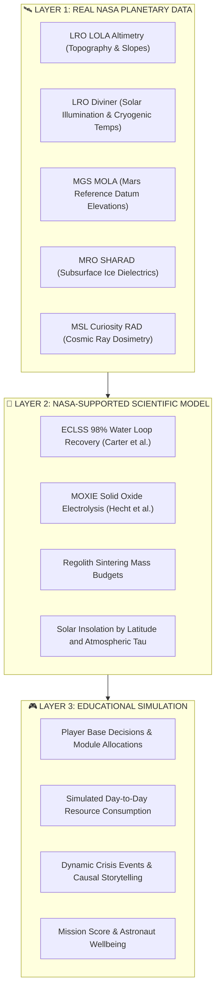

# 🚀 OUTPOST: Junior Astronaut Mission Trainer
> **NASA Space Apps Challenge 2026** — *Junior Astronaut Mission Trainer*  
> *"Build smart. Survive longer. Discover more."* • *"বিজ্ঞান ও সিদ্ধান্তের শক্তিতে টিকে থাকা।"*

[](./TESTING.md)
[](https://react.dev/)
[](https://tailwindcss.com/)
[](https://www.spaceappschallenge.org/)
[](./public/manifest.json)
[](#-bilingual-localization-system-বাংলা--english)
[](./ASSET_LICENSES.md)

---

## 📖 Table of Contents
1. [Project Overview & Core Educational Principle](#1-project-overview--core-educational-principle)
2. [The 3-Layer NASA Data Architecture](#2-the-3-layer-nasa-data-architecture)
3. [Authentic NASA Planetary Datasets & Treks Integration](#3-authentic-nasa-planetary-datasets--treks-integration)
4. [Key Features & Gameplay Mechanics](#4-key-features--gameplay-mechanics)
5. [Autonomous Rover Sortie & ECLSS Mass Balance](#5-autonomous-rover-sortie--eclss-mass-balance)
6. [Bilingual Localization System (বাংলা ↔ English)](#6-bilingual-localization-system-বাংলা--english)
7. [Mobile-First & Touch-Friendly Design](#7-mobile-first--touch-friendly-design)
8. [Technology Stack](#8-technology-stack)
9. [Installation & Quick Start](#9-installation--quick-start)
10. [Automated Verification & Tests](#10-automated-verification--tests)
11. [NASA Citations, Data Attribution & Compliance](#11-nasa-citations-data-attribution--compliance)
12. [License](#12-license)

---

## 1. Project Overview & Core Educational Principle

**OUTPOST: Junior Astronaut Mission Trainer** is an authentic, browser-based space systems engineering and life-support simulation game built for the **NASA Space Apps Challenge 2026**.

The application places students and young learners in the commander's seat of an off-world research base situated on either the **Moon (Lunar South Pole / Basaltic Plains)** or **Mars (Crater Basins / Volcanic Shield)**. 

### 🎯 The Core Educational Principle
> **"Every engineering decision has consequences."**

In extraterrestrial exploration, launch mass from Earth is strictly constrained, solar power varies with planetary tilt and dust, and life support loops must approach complete closure. Players must balance competing trade-offs between:
- **Oxygen ($O_2$) & Water ($H_2O$)**
- **Power Generation & Energy Storage**
- **Regolith Radiation Shielding**
- **Hydroponic Food Production**
- **Crew Morale & Physical Health**
- **In-Situ Spare Parts Fabrication**
- **Scientific Exploration Output**

---

## 2. The 3-Layer NASA Data Architecture

To ensure scientific credibility while delivering an engaging educational game, OUTPOST strictly follows the **Three-Layer Separation Rule**:



- **Layer 1 (Real NASA Data):** Real landing coordinates, planetary elevations, terrain slopes, thermal ranges, and cosmic ray background levels sourced directly from NASA missions. **Never fabricated.**
- **Layer 2 (Scientific Model):** Real-world chemical, biological, and engineering transfer functions derived from published NASA papers (e.g., $0.84\text{ kg } O_2/\text{crew}/\text{day}$, $2.5\text{ kg } H_2O/\text{crew}/\text{day}$).
- **Layer 3 (Educational Simulation):** Player gameplay variables and decisions. The game clearly communicates to learners that simulated resource bars reflect their management choices, not live spacecraft feeds.

---

## 3. Authentic NASA Planetary Datasets & Treks Integration

OUTPOST integrates data and portal connections from **NASA Solar System Treks** ([trek.nasa.gov](https://trek.nasa.gov/)) and the **NASA Planetary Data System (PDS)**:

| Planetary Instrument | NASA Dataset Identifier | Real Parameter Utilized | Gameplay Impact |
| :--- | :--- | :--- | :--- |
| **LRO LOLA** | `LDEM_128 / SLDEM2015` | Elevation (km) & Crater Slope (deg) | Higher slope increases habitat anchoring cost & spare parts consumption |
| **LRO Diviner** | `DLRE Cumulative Illumination` | Polar Grazing Sunlight (86–90%) & PSR Temps (-246°C) | Continuous power bonus at Peak of Eternal Light; eliminates 14-day night blackout |
| **MGS MOLA** | `MEGDR_128 Gridded Topography` | True Martian elevations relative to 6.1 mbar datum | Regolith leveling difficulty & atmospheric pressure variations |
| **MRO SHARAD** | `Subsurface Radar Soundings` | 1.5–2.5m shallow ice sheets (Arcadia Planitia) | Unlocks +40% in-situ water extraction bonus |
| **MSL RAD** | `MSL Calibrated Dose Equivalent` | Background GCR rate (~0.64 mSv/sol) | Sets base radiation shielding requirement for crew cellular health |
| **Perseverance MOXIE** | `Mars 2020 PDS Engineering Logs` | $CO_2 \rightarrow O_2$ SOEC conversion efficiency | Calibrates atmospheric life-support oxygen extraction rates |
| **ISS ECLSS** | `ICES-2023-142 Water Architecture` | 98% catalytic loop closure efficiency | Governs gray/black water distillation recovery rates |

### 8 Authentic NASA Landing Sites
1. **Shackleton Crater Rim (Moon)** — `89.9° S, 0.0° E` | $+1.12\text{ km}$ elev | $86\%$ persistent solar illumination | Artemis Base Camp candidate.
2. **Malapert Mountain (Moon)** — `84.9° S, 12.9° E` | $+5.0\text{ km}$ elevation | High-altitude Earth communications vantage.
3. **Oceanus Procellarum (Moon)** — `3.0° S, 23.4° W` | $-1.4\text{ km}$ elev | Flat volcanic plains; subject to 14-day lunar nights.
4. **Taurus-Littrow Valley (Moon)** — `20.19° N, 30.77° E` | Apollo 17 site | Deep mountain valley with natural radiation horizon shielding.
5. **Jezero Crater (Mars)** — `18.38° N, 77.58° E` | $-2.5\text{ km}$ elev | Perseverance rover landing site; ancient river delta rich in carbonates.
6. **Olympus Mons Base (Mars)** — `18.65° N, 226.2° E` | $+21.2\text{ km}$ elev | Solar elevation advantage above low-altitude atmospheric dust.
7. **Arcadia Planitia (Mars)** — `39.2° N, 189.7° E` | $-3.0\text{ km}$ elev | Confirmed shallow subsurface sheet water ice detected by SHARAD radar.
8. **Valles Marineris (Mars)** — `14.0° S, 59.2° W` | $-7.0\text{ km}$ elev | Dramatic 7 km deep canyon providing atmospheric radiation shielding.

---

## 4. Key Features & Gameplay Mechanics

### 🎮 Dual Gameplay Modes
- **Junior Mission Mode:** Plain-language alerts, visual color indicators, crew mood portraits, friendly decision tips, and simplified life support meters.
- **Mission Commander Mode:** Full aerospace telemetry, engineering load curves, ECLSS loop closure fractions, absorbed ionizing radiation rates ($\text{mSv/day}$), and subsystem dependency matrices.

### 🛰️ Interactive Planetary Surface Radar (`PlanetarySurfaceRadar.tsx`)
- High-tech mission control polar radar scanning latitude/longitude grids from $+90^\circ$ to $-90^\circ$.
- Interactive pulsing beacon pins for all 8 authentic landing sites with instant telemetry synchronization and terrain inspection.

### 📜 Official NASA Cadet Flight Certificate (`CadetFlightCertificateModal.tsx`)
- High-resolution, print-ready aerospace graduation diploma upon mission completion.
- Interactive student Callsign entry, verified landing site coordinates, mission survival duration, and academic grade badge ($A/B/C$).
- One-click `@media print` support for instant PDF export or home/classroom printing.

### 🎧 Procedural NASA Audio Engine (`audioEngine.ts`)
- **Apollo & Artemis Quindar Tones:** Synthesized $2524\text{ Hz}$ Intro and $2475\text{ Hz}$ Outro communication handoff tones.
- **Rover Stepper Motor Hum:** Procedural frequency-modulated electric drive sweep ($140\text{ Hz} \rightarrow 260\text{ Hz}$).
- **Regolith Core Drill:** Harmonic mechanical resonance ($420\text{ Hz} \rightarrow 580\text{ Hz}$).
- 100% Web Audio API procedural synthesis with zero external audio file latency.

### 🌪️ Dynamic Events & Causal Storytelling
- Scenarios include Solar Particle Events (SPEs), Martian Global Dust Storms, Hydroponic Nutrient Blight, ECLSS Catalytic Filter Saturation, and Subsurface Ice Cavity Discoveries.
- **Causal Flow:** `Player Decision` $\rightarrow$ `Subsystem Telemetry Shift` $\rightarrow$ `Crew Psychological Effect` $\rightarrow$ `Mission Debrief Consequence`.
- **"Why Did This Happen?" Academy:** Interactive STEM modal detailing underlying aerospace physics, chemical equations, and real NASA flight counterparts.

### 🎓 Teacher Mode & Classroom Portal
- Classroom scenario code generator for lesson planning.
- Alignment with **7 Next Generation Science Standards (NGSS)**.
- Socratic discussion debrief prompts for teacher-led classroom reviews.

---

## 5. Autonomous Rover Sortie & ECLSS Mass Balance

### 🚜 Autonomous Rover Sortie & ISRU Science Prospecting (`RoverSortieModal.tsx`)
Players can deploy the autonomous base rover on scientific sorties to gather critical in-situ resources:
- **3 Site-Specific Missions:** e.g., *Shackleton PSR Cryogenic Ice Sampling*, *Jezero Ancient Delta Core Drilling*, or *Arcadia Subsurface Radar Ground-Truthing*.
- **Live 2-Phase Sortie Animation:** Hazard trajectory navigation $\rightarrow$ high-speed regolith core drilling $\rightarrow$ autonomous docking.
- **ISRU Resource Recovery:** Directly injects retrieved water ($H_2O$), emergency batteries, 3D printing spare parts, and planetary science points into the active outpost state.

### ♻️ NASA ECLSS Closed-Loop Mass Balance Flow Diagram (`EclssFlowDiagram.tsx`)
An interactive, 4-node closed-loop mass balance diagram integrated directly into Commander Telemetry:
1. **WPA / UPA Water Recovery:** Urine distillation and condensate recovery operating at up to $98\%$ loop closure.
2. **OGA Water Electrolysis:** Splitting recovered water into breathable $O_2$ and hydrogen ($2\text{H}_2\text{O} \rightarrow 2\text{H}_2 + \text{O}_2$).
3. **Crew Metabolism:** Human consumption calibrated at $0.84\text{ kg } O_2/\text{day}$ and $2.5\text{ kg } H_2O/\text{day}$.
4. **CDRA & Sabatier / MOXIE:** Carbon dioxide scrubbing and reduction recovering water or venting carbon monoxide.

---

## 6. Bilingual Localization System (বাংলা ↔ English)

OUTPOST offers full, seamless bilingual parity designed specifically for both international and Bangladeshi STEM learners:
- **Instant Toggle:** Switch between English and natural, kid-friendly Bengali (সহজ ও প্রমিত বাংলা) at any moment without resetting mission progress.
- **Educational Dual-Terminology:** Scientific concepts display dual terms (e.g., `অক্সিজেন (Oxygen)`, `রেগোলিথ (Regolith)`, `সৌর প্যানেল (Solar Panel)`) ensuring learners master internationally recognized space engineering terms.
- **Dynamic Bengali Numerals:** Metrics, percentages, dates, and days automatically format into native Bengali digits (`০, ১, ২, ৩...`) when toggled to Bengali.
- **Typography Optimization:** Seamless font integration featuring Google's `Hind Siliguri` and `Noto Sans Bengali` with zero clipping or layout overflow.
- **Persistent Storage:** Retains language preferences via `localStorage` across user sessions.

---

## 7. Mobile-First & Touch-Friendly Design

The entire UI has been meticulously tested and optimized across mobile screen widths:
- **Standard Breakpoints:** `320px`, `360px`, `375px`, `390px`, `414px`, `430px`, and tablets/desktops.
- **Zero Horizontal Overflow:** Guaranteed `overflow-x: hidden` with fluid flexbox and CSS grid layouts.
- **Touch Ergonomics:** All buttons, toggles, and modals feature a minimum $44\text{px} \times 44\text{px}$ touch target area.
- **PWA Offline Support:** Complete `manifest.json` and `sw.js` (Service Worker) allowing mobile installation as a standalone home-screen web application that runs 100% offline.

---

## 8. Technology Stack

- **Core Framework:** [React 19](https://react.dev/) + [TypeScript](https://www.typescriptlang.org/) (Strict type checking)
- **Build Tool:** [Vite 8](https://vite.dev/) (Rapid HMR & ultra-fast production bundling)
- **Styling & Theme:** [Tailwind CSS v4](https://tailwindcss.com/) with customized aerospace theme tokens
- **Vector Graphics:** Responsive SVG 2.5D Outpost Canvas with animated power/water flow lines
- **Sound Architecture:** Procedural Web Audio API engine (Apollo Quindar tones, motor hums, alarms)
- **Testing:** [Vitest](https://vitest.dev/) automated unit and integration test framework
- **Icons:** [Lucide React](https://lucide.dev/)
- **Visual FX:** [Canvas Confetti](https://www.npmjs.com/package/canvas-confetti)

---

## 9. Installation & Quick Start

### Prerequisites
- [Node.js](https://nodejs.org/) (v18.0.0 or higher recommended)
- [npm](https://www.npmjs.com/) (v9.0.0 or higher)

### Setup Steps
```bash
# 1. Clone the repository
git clone https://github.com/jihadjp/ares-mission.git
cd ares-mission

# 2. Install project dependencies
npm install

# 3. Start local development server
npm run dev
```

Open your browser and navigate to `http://localhost:5173`.

---

## 10. Automated Verification & Tests

The project includes an automated test suite verifying state management, simulation tick equations, payload budgets, and bilingual localization parity:

```bash
# Run unit tests via Vitest
npm test

# Build production bundle with strict TypeScript checking
npm run build
```

### Test Suite Status
- **Simulation Engine Tests:** 9/9 Passed (Oxygen, Water, Power, Crew Health, Failure Cascades).
- **i18n Localization Tests:** 9/9 Passed (Bengali numeral formatting, bilingual parity, dictionary validation).
- **Total Passing Tests:** **18 / 18 Passed (100%)**.

---

## 11. NASA Citations, Data Attribution & Compliance

All planetary topography, life support benchmarks, and scientific parameters utilized in this project originate from publicly available NASA science and exploration archives:
1. **Carter, D. L., et al. (2023).** *Exploration Water Recovery System Architecture and Ground Testing Milestones*. 52nd International Conference on Environmental Systems (ICES-2023-142).
2. **Hecht, M., et al. (2021).** *Mars Oxygen ISRU Experiment (MOXIE)*. Space Science Reviews, 217(1), 9.
3. **Hassler, D. M., et al. (2014).** *Mars’ Surface Radiation Environment Measured with the Curiosity Rover*. Science, 343(6169), 1244797.
4. **Smith, D. E., et al. (2010).** *The Lunar Orbiter Laser Altimeter Investigation on the Lunar Reconnaissance Orbiter Mission*. Space Science Reviews, 150, 209–241.
5. **NASA Solar System Treks:** Planetary spatial visualization and mission landing site layers ([https://trek.nasa.gov/](https://trek.nasa.gov/)).
6. **NASA Planetary Data System (PDS):** Geosciences, Atmospheres, and PPI Nodes ([https://pds.nasa.gov/](https://pds.nasa.gov/)).

*For detailed paper citations and document links, see [`SOURCES.md`](./SOURCES.md).*

---

## 12. License

This project is open-source software licensed under the **[MIT License](./ASSET_LICENSES.md)**.  
All NASA technical data, mission information, and planetary names are used in accordance with NASA Open Data and Media Usage guidelines for non-commercial educational purposes.

---
**Made with ❤️ for the NASA Space Apps Challenge 2026**
