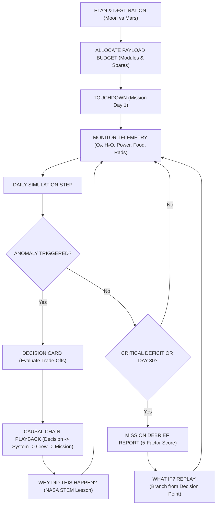

# OUTPOST: Junior Astronaut Mission Trainer
> **NASA Space Apps Challenge 2026** — *Junior Astronaut Mission Trainer*  
> *"Build smart. Survive longer. Discover more."*

[](./TESTING.md)
[](https://react.dev/)
[](https://www.spaceappschallenge.org/)
[](./ASSET_LICENSES.md)

---

## 1. Project Overview & Vision

**OUTPOST: Junior Astronaut Mission Trainer** is a cinematic, browser-based space systems simulation game created for the **NASA Space Apps Challenge 2026**. 

The simulation puts students and young learners in the commander's seat of a permanent extraterrestrial research outpost on either the **Moon (Shackleton Crater)** or **Mars (Chryse Planitia)**. 

### The Core Educational Principle
> **"Every engineering decision has consequences."**

In space, there is no infinite budget and no rescue truck. Every kilogram launched from Earth, every watt of solar electricity, every liter of water, and every mole of oxygen must be accounted for. Players experience real aerospace engineering trade-offs between life support, radiation shielding, power generation, crop production, science discovery, and base resilience.

---

## 2. Key Features

- **🎮 Dual Gameplay Modes**:
  - **Junior Mission Mode**: Friendly plain-language alerts, clear visual feedback, illustrated astronaut statuses, decision guidance, and simplified telemetry.
  - **Mission Commander Mode**: Detailed engineering telemetry, power load breakdowns, ECLSS loop closure percentages, absorbed radiation dosimetry (mSv/day), and dependency coupling matrices.
- **🪐 Real Planetary Physics (Moon vs Mars)**:
  - **The Moon**: Hard vacuum (0 kPa), peaks of eternal light, 14-day lunar nights, extreme temperatures (-130°C to +120°C), and intense cosmic ray exposure.
  - **Mars**: Thin CO₂ atmosphere (0.6 kPa), dust storms that degrade solar panels, atmospheric optical depth (Tau factor), and realistic communication latency (4–20 minutes).
- **🔄 Six Interconnected Core Resources**:
  1. **Oxygen (O₂)**: Electrolysis + photosynthetic plant transpiration vs crew respiratory consumption.
  2. **Water (H₂O)**: Reclaimed via closed-loop ECLSS catalytic distillation (up to 98% efficiency) vs crew hydration and greenhouse irrigation.
  3. **Power**: Photovoltaic solar array generation vs base module loads; automated low-power load shedding.
  4. **Food**: Fresh hydroponic crops (Vitamin C/K) vs vacuum-sealed pantry ration packs.
  5. **Radiation Shielding**: Hydrogen-rich materials (water bladders) and sintered regolith berms absorbing cosmic rays and solar flares.
  6. **Spare Parts**: In-situ 3D additive manufacturing vs mechanical wear-and-tear and fault recovery.
- **👨‍🚀 Specialized Astronaut Crew**:
  - Commander (Maya Lin): Expedition leadership & morale resilience bonus (+15%).
  - Engineer (Tariq Al-Mansoor): Power & ECLSS repair efficiency (+25% repair, -30% spare parts consumed).
  - Biologist (Elena Rostova): Hydroponic crop yield (+20%) & water loop recovery (+15%).
  - Scientist (Marcus Chen): Planetary geology & science discovery throughput (+35%).
- **🌪️ Dynamic Events & Decision Cards**:
  - Atmospheric Dust Storms, Hydroponic Nutrient Blight, Coronal Mass Ejections (Solar Particle Events), Distillation Filter Clogs, Sabatier Reactor Saturation, and Subsurface Water Ice Discoveries.
- **⚡ Causal Storytelling**:
  - Visualizing the causal progression: `DECISION -> SYSTEM CHANGE -> CREW EFFECT -> MISSION OUTCOME`.
- **🔬 "Why Did This Happen?" Educational Academy**:
  - Interactive STEM modal explaining the underlying NASA physics, chemical reactions, formulas, and real-world mission counterparts (e.g., MOXIE, ISS ECLSS, Veggie, Curiosity RAD).
- **⏱️ 60-Second Judging Demo Mode**:
  - Automated/interactive showcase enabling hackathon judges to experience the entire launch-to-debrief loop in under 2 minutes.
- **🎓 Teacher Mode & STEM Curriculum Portal**:
  - Classroom scenario code generator, 7 Next Generation Science Standards (NGSS) learning objectives, and Socratic discussion debrief prompts.
- **📊 Mission Debrief & "What If?" Decision Branching Replay**:
  - 5-factor scoring model (Survival, Efficiency, Science, Resilience, Learning) with 30-day visual timeline and decision branching replay tool.
- **🔊 Procedural Sound Synthesizer**:
  - 100% offline Web Audio API sound generator (ambient space drone, telemetry beeps, emergency klaxons, success chimes).
- **🇧🇩 Bilingual Language System (বাংলা ↔ English)**:
  - **Full-Game Coverage**: Instant toggle between natural Bangladeshi Bengali (সহজ ও সাবলীল বাংলা) and English without page reload or active mission reset.
  - **Educational Dual-Terminology**: Core scientific concepts feature dual terms (`অক্সিজেন (Oxygen)`, `বিকিরণ (Radiation)`, `সৌর প্যানেল (Solar Panel)`, `রেগোলিথ (Regolith)`) so young learners simultaneously grasp international STEM terminology.
  - **Native Numeral Localization**: Dynamic formatting automatically renders metrics, percentages, and days in native Bengali numerals (`০-৯`) when toggled to Bengali.
  - **Typography & Font Optimization**: High-fidelity Google Fonts integration (`Hind Siliguri` & `Noto Sans Bengali`) ensuring zero layout clipping or text overlap.
  - **Persistent Preference**: Stored in `localStorage` (`outpost_language_pref`), defaulting to English with instant synchronization across all dialogs and screens.
- **♿ Accessibility & Performance**:
  - Color-independent badges (`✓ SAFE`, `⚠ WARNING`, `✕ CRITICAL`), keyboard shortcuts, reduced-motion compliance, responsive mobile layout, 60 FPS target.

---

## 3. Quick Start & Installation

### Prerequisites
- Node.js (v18.0.0 or higher)
- npm (v9.0.0 or higher)

### Installation
```bash
# Clone the repository
git clone https://github.com/jihadjp/nasa-junior-astronaut-trainer.git
cd nasa-junior-astronaut-trainer

# Install dependencies
npm install

# Start development server
npm run dev
```

Visit `http://localhost:5173` in your web browser.

### Running Automated Test Suite
```bash
npm test
```

### Production Build
```bash
npm run build
```

---

## 4. The Core Game Loop



---

## 5. Technology Stack

- **Frontend Framework**: React 19 + TypeScript (Strict Type Safety)
- **Styling & Design System**: Tailwind CSS v4 + Space Grotesk / Inter typography
- **Visuals & Canvas**: Interactive SVG 2.5D Outpost Visualizer with animated power buses and radiation particle field
- **Audio Architecture**: Procedural Web Audio API Synthesizer (Zero asset download required, 100% offline)
- **Animation & Confetti**: CSS Keyframes + Canvas-Confetti
- **Testing**: Vitest 5.0 unit and integration test runner
- **Icons**: Lucide React technical mission-control icon set

---

## 6. Project Documentation Index

- [`ARCHITECTURE.md`](./ARCHITECTURE.md): Technical architecture, state machine, and simulation tick engine.
- [`GAME_DESIGN.md`](./GAME_DESIGN.md): Game systems mechanics, trade-off formulas, and event catalog.
- [`EDUCATIONAL_MODEL.md`](./EDUCATIONAL_MODEL.md): STEM curriculum alignment, aerospace physics, and classroom guide.
- [`SOURCES.md`](./SOURCES.md): NASA citations, Planetary Data System records, and technical report references.
- [`ASSET_LICENSES.md`](./ASSET_LICENSES.md): Asset registry, open-source licenses, and legal compliance.
- [`TESTING.md`](./TESTING.md): Verification test suite, scenario test results, and browser matrix.

---

## 7. NASA Data & Educational References

- **NASA ECLSS Exploration Water Recovery Architecture** (ICES-2023-142)
- **Mars Oxygen ISRU Experiment (MOXIE)** on the Perseverance Rover
- **Curiosity Rover Radiation Assessment Detector (RAD)** surface dosimetry
- **Lunar Reconnaissance Orbiter (LRO)** Diviner & CRaTER instruments
- **NASA Veggie & Advanced Plant Habitat (APH)** facilities on the ISS
- **NASA Systems Engineering Handbook** (NASA/SP-2016-6105 Rev 2)

---

## 8. License

This project is licensed under the **MIT Open Source License**. See [`ASSET_LICENSES.md`](./ASSET_LICENSES.md) for details.
All NASA data and technical benchmarks are used under public domain educational fair-use principles in accordance with the NASA Space Apps Challenge 2026 rules.
